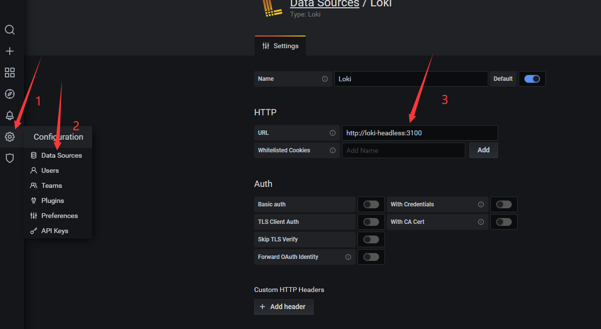
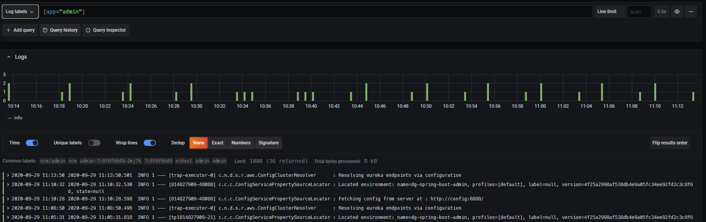

# 文件说明
```
[root@master 17-loki-promtail-grafana]# tree
.
├── 00-loki-values.yaml         ==> loki的values.yaml文件
├── 01-promtail-values.yaml     ==> 修改过的promtail values.yaml文件
├── 02-grafana-configmap.yaml   ==> grafana configmap
├── 03-grafana-deployment.yaml  ==> grafana deployment文件
├── grafana.png                 ==> grafana datasource config picture
└── README.md
└── showme.png			==> 效果图
```
## loki的组成:
1. loki是主服务器,负责存储日志和处理查询
2. promtail是代理,负责收集日志并将其发送给loki
3. grafana用于ui的展示

## 安装loki + promtail + grafana首先要安装helm2, 注意是helm2, 我是以helm2这个版本来安装的
```
[root@master ~]# helm version
Client: &version.Version{SemVer:"v2.16.9", GitCommit:"8ad7037828e5a0fca1009dabe290130da6368e39", GitTreeState:"clean"}
Server: &version.Version{SemVer:"v2.16.9", GitCommit:"8ad7037828e5a0fca1009dabe290130da6368e39", GitTreeState:"clean"}
```
## 需要安装的服务参考链接
1. helm2的安装可以参考这个链接  ==>    
2. install storageclass ==> 

---
# 安装loki
```
1. 添加chart仓库
helm repo add loki https://grafana.github.io/loki/charts
helm repo add stable  https://kubernetes.oss-cn-hangzhou.aliyuncs.com/charts

2. 更新chart仓库
helm repo update

3. 安装loki/loki-stack
[root@master ~]# helm search loki
NAME           	CHART VERSION	APP VERSION	DESCRIPTION
loki/loki      	0.31.1       	v1.6.0     	Loki: like Prometheus, but for logs.
loki/loki-stack	0.40.1       	v1.6.0     	Loki: like Prometheus, but for logs.
loki/fluent-bit	0.3.0        	v1.6.0     	Uses fluent-bit Loki go plugin for gathering logs and sen...
loki/promtail  	0.24.0       	v1.6.0     	Responsible for gathering logs and sending them to Loki

请安装loki/loki-stack 0.40.1
helm fetch loki/loki-stack
下载下来的包在: /root/.helm/repository/local下面,然后解压
或者
helm fetch loki/loki-stack --untar
会在当前的目录下面生成一个loki-stack目录
修改loki的values.yaml文件

进入到 loki-stack/charts/loki/目录里面去修改values.yaml文件,这个文件我已帮你修改好了,名称为 00-loki-values.yaml
[root@master loki]# cd loki-stack/
[root@master loki-stack]# ls
charts  Chart.yaml  README.md  requirements.lock  requirements.yaml  templates  values.yaml
[root@master loki-stack]# cd charts/
[root@master charts]# ls
filebeat  fluent-bit  grafana  logstash  loki  prometheus  promtail

修改的地方,主要是添加了持久卷,永久的保存数据, 在values.yaml文件的119-120行
下面是vimdiff对比的不同点, df-nfs-storage是我的storageclass的名称

 persistence:                                           |  119 persistence:
  120   enabled: true                                        |  120   enabled: false
  121   storageClassName: dg-nfs-storage

还有一些别的配置可以优化
 90   table_manager:
 91     retention_deletes_enabled: false
 92     retention_period: 0s
默认是不会循环删除里面的数据,一直保存着,我的磁盘比较小,我设置成28天,即是672h, 注意一定要是168(7天)的倍数 168 * 4
我修改成28天
 90   table_manager:
 91     retention_deletes_enabled: true
 92     retention_period: 672h

修改完成之后安装, scm是我的namespace
helm install loki -f loki/values.yaml -n loki --namespace scm
卸载
helm delete --purge loki
查看,注意这个loki是sts控制器
kubectl get pods -n scm
loki-0                              1/1     Running   0          10d

[root@master loki]# kubectl get sts -n scm
NAME       READY   AGE
eureka     3/3     109d
kafka      3/3     70d
loki       1/1     10d
rabbitmq   3/3     69d
zk         3/3     117d

[root@master loki]# helm list -a
NAME    	REVISION	UPDATED                 	STATUS  	CHART          	APP VERSION	NAMESPACE
loki    	1       	Fri Sep 18 14:05:01 2020	DEPLOYED	loki-0.31.1    	v1.6.0     	scm
promtail	1       	Fri Sep 18 15:05:51 2020	DEPLOYED	promtail-0.24.0	v1.6.0     	scm
```

# 安装promtail
```
1. 修改promtail的values.yaml文件, 这里我的docker Root变化了,修改成/dgmall/docker了,要把values文件修改一下o
查看docker Root
[root@master ~]# docker info|grep -i root
Docker Root Dir: /dgmall/docker

修改如下:
103 volumes:
104 - name: docker
105   hostPath:
106     #path: /var/lib/docker/containers
107     path: /dgmall/docker/containers
108 - name: pods
109   hostPath:
110     path: /var/log/pods
111
112 # Custom volumes together with the default ones
113 extraVolumes: []
114
115 volumeMounts:
116 - name: docker
117   mountPath: /dgmall/docker/containers
118   readOnly: true
119 - name: pods
120   mountPath: /var/log/pods
121   readOnly: true

attention attention attention 注意, 重要的事情说三遍,说三遍,说三遍:
修改promtail连接loKi服务器的地址: 33行,如果不对,一切白搞
 31 loki:
 32   #serviceName: ""  # Defaults to "${RELEASE}-loki" if not set
 33   serviceName: "loki-headless"  # Defaults to "${RELEASE}-loki" if not set
 34   servicePort: 3100
 35   serviceScheme: http
 36   # user: user
 37   # password: pass

安装
helm install promtail -f promtail/values.yaml -n promtail --namespace scm

```

# grafana安装
```
我是用的yaml文件来搞的,文件上传了
注意修改namespace和storageclass的名字,数据我已做了持久化,妈妈在也不用担心我的数据没有了.
安装
kubectl create -f .
```
=======
- 
- 

thank you !!!
