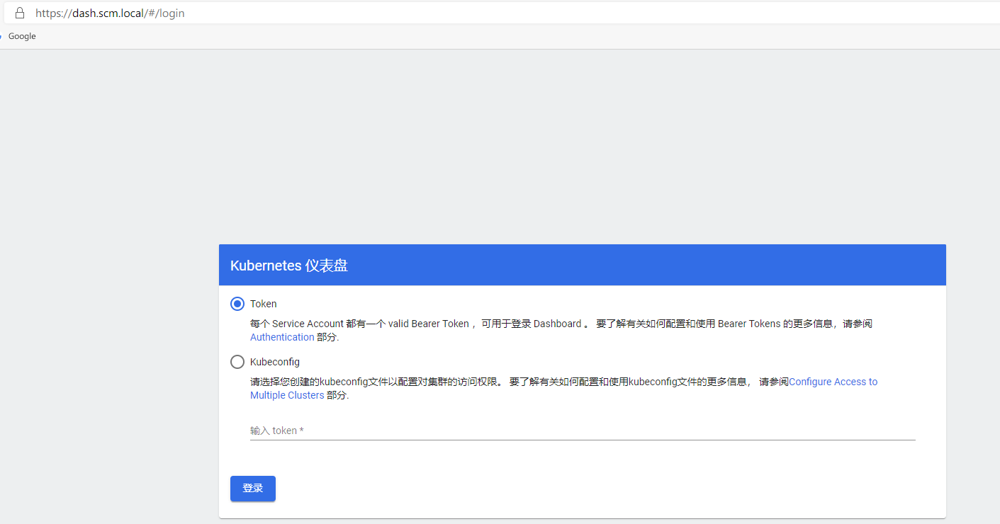

# 最新版的Traefik v2.2 Deploy

- traefik-deploy-file：traefik v2.2 部署文件
- traefik-route-file：traefik v2.2 路由规则配置文件
- tls.crt tls.key是证书和key，测试用的

---
1. 安装traefik
```
kubectl create -f 00-traefik-crd.yaml
rbac我是安装在kube-system
kubectl create -f 01-traefik-rbac.yaml
kubectl create -f 02-traefik-config.yaml -n kube-system # 安装在kube-system里面
kubectl create -f 03-traefik-deploy.yaml -n kube-system
```
2. 路由配置有两种方式，我只用crd，ingress详见里面的文档traefik-ingress-file   
mkcert的链接地址如下：    

```
首先你要创建证书，可以用开源工具mkcert，以前的文档里面有说明，很简单，两步就可以
kubectl create secret generic scm-local-tls --from-file=tls.crt --from-file=tls.key -n kube-system

这个是用http访问traefik dashboard
kubectl create -f  traefik-dashboard-route.yaml -n kube-system

这个是用https访问traefik dashboard
kubectl create -f traefik-dashboard-route-tls.yaml -n kube-system

生成secret
kubectl create secret generic scm-local-tls --from-file=tls.crt --from-file=tls.key -n kubernetes-dashboard
这个是用https访问kubernetes dashboard
kubectl create -f kubernetes-dashboard-route.yaml -n kubernetes-dashboard

如果有问题，可以查看
kubectl logs -f traefik-ingress-controller-fnh94 -n kube-system
```

3. 效果
   

